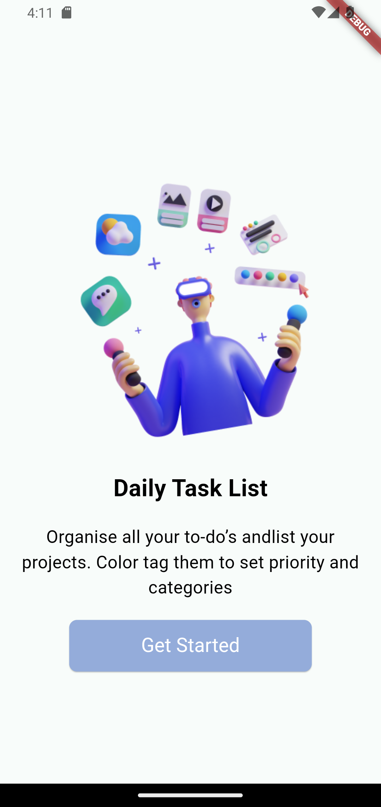
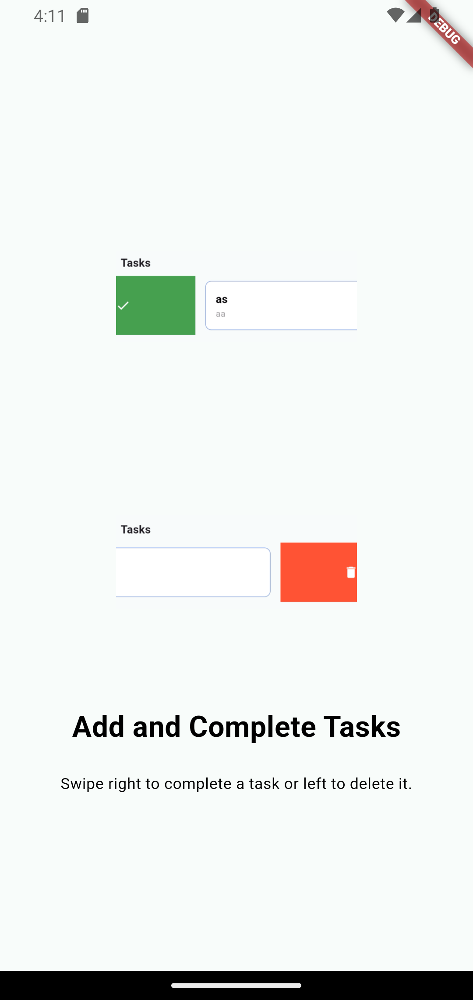
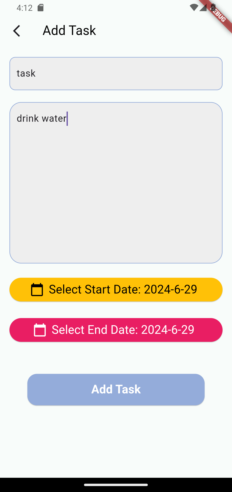
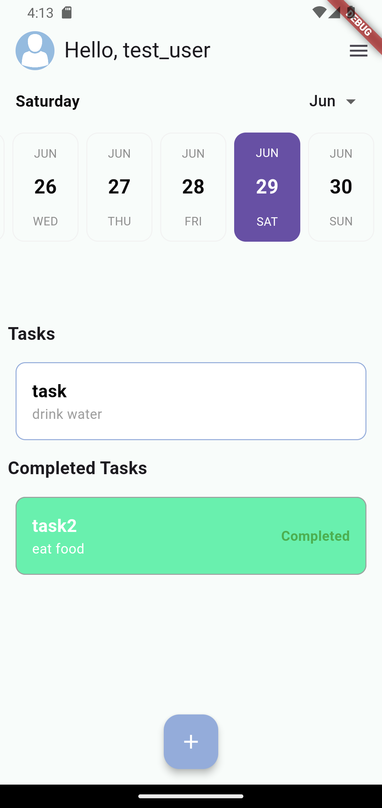
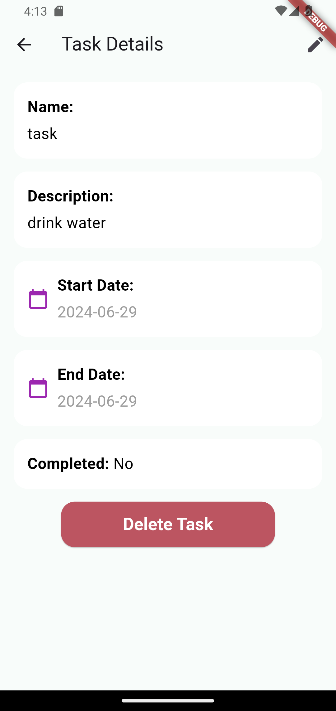
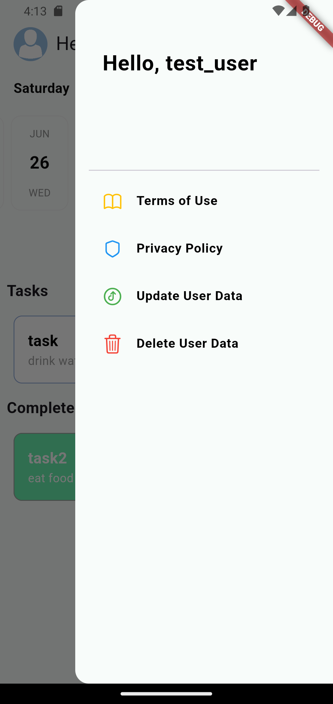

# BeforeSunset AI Mobile Case Study

## Question 1: If you have all the power in the company, what would you change about this [beforesunset.ai](http://beforesunset.ai) web app? What do you think we can do better? How would you improve BS?

If I had full authority at the company, I have some ideas for changes and improvements I could make to the BeforeSunset AI web application. Firstly, I would work on making the user interface more intuitive and user-friendly. I find that the example Todo application design in the Figma link is a bit complex. Particularly, I believe that developing a more visual interface design would make tasks and projects easier to track and manage. It's important for users to quickly access information and easily perform tasks with a simple and modern design.

For instance, we could add an AI assistant that offers suggestions based on user habits and workflow. This could help users optimize their time management and work more efficiently. I have also tested the mobile application and believe there are many features we could add. I am convinced that the application could be significantly improved.

## Question 2: Give an example of an app that you think offers the best user experience? Why?

In my opinion, an application that exemplifies excellent user experience is Praktika. Praktika is an app that facilitates English learning through AI-powered virtual tutors. It allows users to practice real-world conversations and receive instant feedback.

Why did I choose Praktika? Because it offers personalized study plans with AI avatars. These avatars guide users through their language learning journey and provide opportunities for conversation practice. Avatars tailor lessons based on users' skills and interests. During conversation practice, users receive instant feedback from AI avatars, helping them correct errors and improve pronunciation. This feature makes language learning more engaging and interactive. Users can practice English anytime, anywhere.

I believe the concept of video conversations has been exceptionally implemented with AI, and this experience can be applied in other fields as well. Particularly, I have an idea for creating an AI-powered psychological counseling application. Such an app could make emotional and psychological support more accessible, facilitating counseling services. Applying similar principles in other domains can lead to the development of AI-powered solutions.

# To-do App

## Description

This is a simple To-do app built using Flutter and Bloc for state management. The app allows users to:

1.  Add new tasks.
2.  Remove tasks by swiping right.
3.  Mark tasks as complete by swiping left.

## Features

### Main Screen:

-   **Task List:** Displays a list of tasks with checkboxes.
-   **Floating Action Button (FAB):** Allows users to add new tasks.

### Add Task Screen:

-   **Input Field:** Users can enter the task name.
-   **Save Button:** Saves the new task and returns to the main screen.

### Additional Features:

-   **Swipe to Delete:** Users can swipe right to delete a task.
-   **Swipe to Complete:** Users can swipe left to mark a task as complete.
-   **Clean and Minimalistic UI:** The app has a simple and user-friendly interface.

## Screenshots

## Installation

1.  **Clone the repository:**
       
    
    `https://github.com/kaanygit/mobilecasestudty_beforesunsetai.git` 
    
2.  **Navigate to the project directory:**
    
    `cd todo_app` 
    
3.  **Install dependencies:**
    
    
    `flutter pub get` 
    
4.  **Run the app:**
   
    
    `flutter run` 
    

## Repository

You can find the code and more details in the [GitHub repository](https://github.com/kaanygit/mobilecasestudty_beforesunsetai).

## Packages

 -  cupertino_icons: ^1.0.6
  - flutter_bloc: ^8.1.6
  - equatable: ^2.0.5
  - shared_preferences: ^2.2.3
  - uuid: ^4.4.0
  - image_picker: ^1.1.2
  - calendar_date_picker2: ^1.1.5
  - easy_date_timeline: ^1.1.3
  -  mockito: ^5.4.4
  - bloc_test: ^9.1.7
  - flutter_launcher_icons: ^0.13.1

## Dart & Flutter Version
- Flutter 3.22.2
- Dart SDK version: 3.4.3 
----------

Thank you for reviewing my case study and To-do app! I look forward to your feedback.
